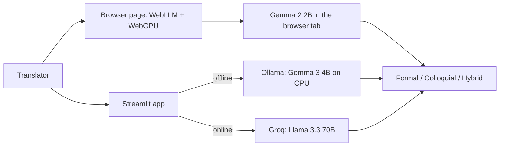

*This is a submission for the [Hacktoberfest Weekend Challenge: Build for a Friend](https://dev.to/challenges/hacktoberfest-weekend-2026-10-01)*

<!-- TODO before publishing: replace or delete every [TODO ...] marker, then delete this comment. -->

## What I Built

**Nepali String Localizer** translates isolated English UI strings into Nepali, using context about where the string appears. It runs in a browser tab on an ordinary laptop, with no install and no API key.

I volunteer as a translator with **Translators without Borders**, and I built this for the people I volunteer alongside: Nepali translators who give their time to humanitarian and open-source projects. Their "friend" here is the whole community. I'm sure there are volunteers who can use this tomorrow, starting with me.

A lot of the software humanitarian teams rely on is open source. KoboToolbox, the data-collection platform that NGOs and field teams use for surveys and crisis response, is one example. Getting its interface into Nepali means someone, usually a volunteer, translating it string by string.

**The problem:** on localization platforms, a translator sees strings one at a time with almost no context. Take `Deploy`. Is it a button, a status message, or a heading in the docs? Each one needs different Nepali. A technical word like "Server" or "Submit" also raises a question: should it be translated, transliterated into Devanagari, or left in English? Volunteers make that call hundreds of times per project, usually alone and in their spare time.

**What it does:** paste the string, add a line of context (for example *"Primary call-to-action button on the server settings page"*), and get three options:

1. **Formal**: standard written Nepali, for docs and strict UI.
2. **Colloquial**: natural, conversational Nepali, for friendly everyday app text.
3. **Transliterated/Hybrid**: technical terms kept in English, written in Devanagari (सबमिट, सर्भर) or left in Latin script when translating them would lose the meaning.

Placeholders like `{name}`, `%s` and HTML tags come back untouched, so a translation never breaks the app.

It doesn't replace the translator. It gives them three solid starting points to pick from or edit, so they spend their time on judgment instead of a blank text box.

[TODO (optional): if you share it with other volunteers before publishing, add one line about what they said.]

## Demo

**Try it in your browser:** https://arjankc.github.io/Localized-String-Assistant/ No install and no API key. The first translation downloads a ~1.5 GB open model into your browser cache.

[TODO: short video or GIF: type "Deploy Form", add context, click Translate, show the three options. Turning Wi-Fi off after the model loads is the best proof that it runs offline.]

## Code



There are two front ends that share one prompt:

- `docs/index.html`: a single static page that runs the model in the browser (WebLLM + WebGPU).
- `app.py`: a ~140-line Streamlit app that talks to a local Ollama server or Groq.

## How I Built It

I built this on a 2018 laptop: an i5-8265U with 16 GB of RAM, integrated Intel UHD 620 graphics and no dedicated GPU. That constraint shaped everything. Volunteers don't usually have workstation GPUs, so if it runs on this machine, it should run on theirs.

- **In-browser inference:** [WebLLM](https://github.com/mlc-ai/web-llm) compiles open-weight models to WebGPU, so **Gemma 2 2B** runs inside a browser tab on integrated graphics. The page checks whether the GPU supports 16-bit float shaders and picks the matching build. Qwen 2.5 1.5B and Llama 3.2 1B are there as lighter options. There's no backend at all: GitHub Pages serves one HTML file, and the model is cached in the browser after the first load.
- **Local inference with Ollama:** for translators who prefer a desktop setup, the Streamlit app runs **Gemma 3 4B** on the CPU through [Ollama](https://ollama.com). Ollama exposes an OpenAI-compatible endpoint, so the standard `openai` Python client talks to it, or to **Llama 3.3 70B** on Groq when more quality is needed. Switching between them only changes the `base_url`.
- **Choosing small models for Nepali:** this was the interesting part. Nepali is a lower-resource language, and many small models were trained mostly on English and a handful of major languages. I leaned on the Gemma family. Gemma 3 was trained on 140+ languages, which makes it the Ollama default, and Gemma 2 2B is the default in the browser. The lighter 1B options are there for very weak machines, with the tradeoff stated in the UI. [TODO: add one line from your own testing, e.g. how the 2B and 1B outputs compared for "Deploy Form".]
- **Prompting:** one prompt does the heavy lifting. It makes the model act as an English-to-Nepali software localization expert, keep placeholders like `{name}` and `%s` intact, stay short enough for UI text, and return exactly three options in a fixed Markdown template. A low temperature (0.3) keeps the output consistent from string to string. Gemma's chat format has no system role, so the browser version sends the instructions in the user turn.

## Why Does Open Innovation Matter?

**It runs on an old laptop, in a browser tab, with no internet.** Volunteer translation happens on personal laptops, not fast office machines. Because the weights are open, a 2B model can be compiled to WebGPU and shipped as a static web page. After the first load, a volunteer can keep translating wherever connectivity is patchy or gone. A closed API simply stops working there.

**Zero setup for volunteers.** Nobody needs Python, Ollama or an API key. I can share one link in a volunteer group and anyone with a recent Chrome or Edge can use it. A closed model can't be shipped like that; it can only be rented through someone's server.

**It costs nothing to run.** This is volunteer work. Nobody should have to put a credit card on file for a per-token API to translate humanitarian software for free. There's no server to pay for either: GitHub Pages hosts the page, and the visitor's own GPU does the inference.

**Unreleased strings stay on the translator's machine.** Strings from unreleased features and internal admin screens never leave the device in the browser and Ollama versions.

**We can swap models, and eventually fine-tune.** Nepali is a lower-resource language, and different open models handle Devanagari very differently. Because the app only depends on an OpenAI-compatible endpoint, switching from Gemma to Llama to Qwen is a config change, not a rewrite. The next step is fine-tuning a small open model on the existing, human-reviewed Nepali translations from KoboToolbox's own translation files, so it learns the project's established terms. That is only possible because the weights are open.

**Open tools for open tools.** Humanitarian software like KoboToolbox is open source, and many of the people translating it are volunteers. It felt right that the tool helping them is open too. Volunteers working in other languages (Maithili, Newari, Tamang, or any language Translators without Borders supports) can fork it, change the prompt, and point it at whichever open model handles their language best.

[TODO (optional): one concrete comparison if you have it, e.g. "Gemma kept 'Server' as सर्भर while [closed model] translated it literally".]

## My Agent Session

[TODO: DevRelay agent session embed or link]

## Prize Categories

[TODO: list the partner categories you're entering, or delete this section]
