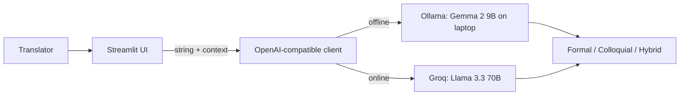

*This is a submission for the [Hacktoberfest Weekend Challenge: Build for a Friend](https://dev.to/challenges/hacktoberfest-weekend-2026-10-01)*

<!-- TODO before publishing: replace every [TODO ...] marker, then delete this comment. -->

## What I Built

**Nepali String Localizer** is a small Streamlit app that translates isolated English UI strings into Nepali, using context about where the string appears.

I built it for **[TODO: friend's name]**, who volunteers translating open-source software into Nepali, including KoboToolbox, the data-collection platform that NGOs and field teams in Nepal use for surveys and humanitarian work.

**The problem:** on localization platforms, a translator sees strings one at a time with almost no context. Take `Deploy`. Is it a button, a status message, or a heading in the docs? Each one needs different Nepali. A technical word like "Server" or "Submit" also raises a question: should it be translated, transliterated into Devanagari, or left in English? [TODO: friend's name] was making that call hundreds of times per project, often by switching between a dictionary, a chat window, and the live app to guess the context.

**What it does:** paste the string, add a line of context (for example *"Primary call-to-action button on the server settings page"*), and get three options:

1. **Formal**: standard written Nepali, for docs and strict UI.
2. **Colloquial**: natural, conversational Nepali, for friendly everyday app text.
3. **Transliterated/Hybrid**: technical terms kept in English, written in Devanagari (सबमिट, सर्भर) or left in Latin script when translating them would lose the meaning.

Placeholders like `{name}`, `%s` and HTML tags come back untouched, so a translation never breaks the app.

[TODO: what your friend said when you handed it over. One honest quote is better than a paragraph.]

## Demo

[TODO: link to a short video or GIF: type "Deploy Form", add context, click Translate, show the three options. If you record it with Ollama, show the Wi-Fi turned off to prove it runs offline.]

## Code

[TODO: GitHub repo link or embed, e.g. ]

The whole app is one file, `app.py` (~140 lines), plus `requirements.txt` with `streamlit`, `openai` and `python-dotenv`.

## How I Built It

- **Open-weight models:** Google's **Gemma 2 9B**, running locally through **Ollama**, and Meta's **Llama 3.3 70B** served by Groq for when the laptop can't handle it.
- **Local inference:** [Ollama](https://ollama.com) exposes an OpenAI-compatible endpoint at `http://localhost:11434/v1`. The app uses the standard `openai` Python client, so the same code talks to the local Ollama server or to Groq. The only difference is the `base_url`.
- **UI:** [Streamlit](https://streamlit.io), which takes an English string and a context box as input and renders the model's Markdown output, with a copy-friendly raw view.
- **Prompting:** a single system prompt does the heavy lifting. It makes the model act as an English-to-Nepali software localization expert, keep placeholders intact, stay short enough for UI text, and return exactly three options in a fixed Markdown template. A low temperature (0.3) keeps the output consistent from string to string.

The provider is a radio button in the sidebar, and models are set with environment variables (`OLLAMA_MODEL`, `GROQ_MODEL`), so trying a different open model is one `ollama pull` away.

## Why Does Open Innovation Matter?

**It runs on a laptop with no internet.** Volunteer localization doesn't only happen on fast office connections. With Ollama and Gemma 2 9B, [TODO: friend's name] can translate on a bus, during a load-shedding power cut on battery, or anywhere connectivity is patchy. A closed API simply stops working there.

**It costs nothing to run.** This is volunteer work. Nobody is going to put a credit card on file for a per-token API to translate KoboToolbox strings for free. Local inference costs nothing, and the hosted fallback runs on a free tier.

**Unreleased strings stay on the translator's machine.** Strings from unreleased features and internal admin screens never leave the laptop in offline mode.

**We can swap models, and eventually fine-tune.** Nepali is a lower-resource language, and different open models handle Devanagari very differently. Because the app only depends on an OpenAI-compatible endpoint, switching from Gemma to Llama to Qwen is a config change, not a rewrite. The next step is fine-tuning a small open model on the existing, human-reviewed Nepali translations from KoboToolbox's own translation files, so it learns the project's established terms. That is only possible because the weights are open.

**Open tools for open tools.** KoboToolbox is open source, and the people translating it are volunteers. It felt right that the tool helping them is open too, so any other localization community (Maithili, Newari, Tamang...) can fork it, change the prompt, and point it at whichever open model handles their language best.

[TODO: one concrete comparison if you have it, e.g. "Gemma kept 'Server' as सर्भर while [closed model] translated it literally", or "worked offline during a power cut".]

## My Agent Session

[TODO: DevRelay agent session embed or link]

## Prize Categories

[TODO: list the partner categories you're entering, or delete this section]
